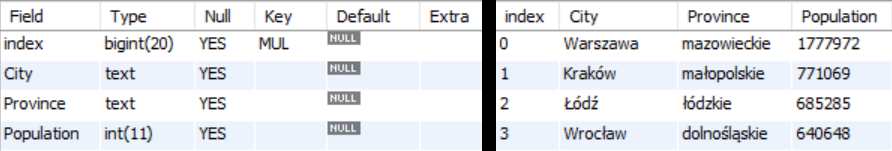
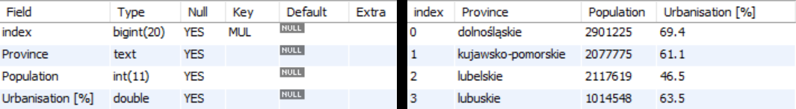
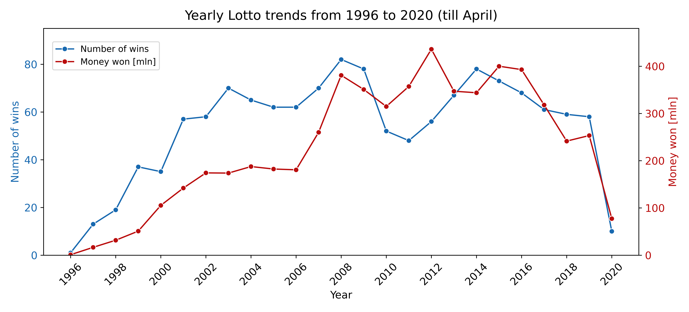
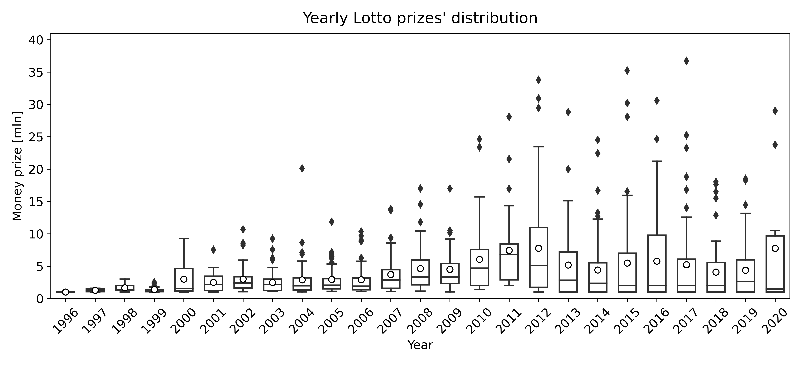
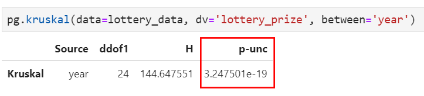
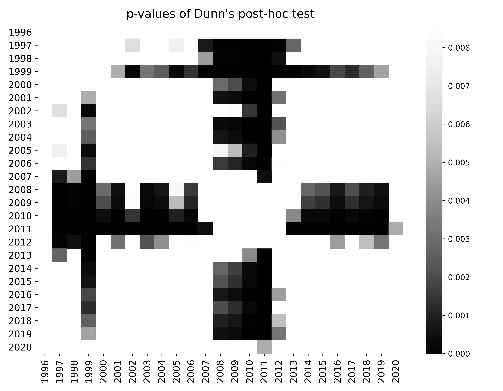
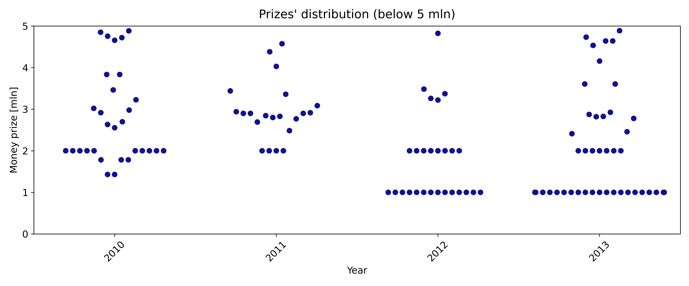
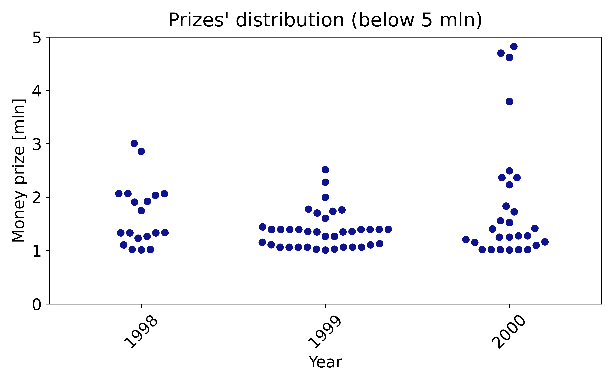

## 1) Introduction
Lotto is the biggest lottery set up in Poland. The main prize goes to those, who correctly select 6 out of 49 numbers and awards reach several dozens of millions of polish zlotys. 

In this project, I am going to analyze data (money award, date, location of the winner) of Lotto main prizes over one million zlotys from the last 20+ years. The analysis will tell, if there are any monthly, yearly and locational patterns in Lotto's wins distribution. While potential findings will not answer how to score 6/6 numbers, it may bring valuable information Lotto's marketers on how, when and where people play Lotto in Poland.

This exploratory data analysis is realised as the final project in "Data Analyst" bootcamp organized by Reaktor PWN.

## 2) Tools and techniques used in the project
* SQL
* Python
* Web scrapping (requests, BeautifulSoup)
* Pandas
* Seaborn
* Statistics (significance testing, pingouin and scikit_posthocs libraries)

## 3) Data colletion

For data storage, a 'lotto' database was created using MySQL database management system.

Lottery data was scraped from http://megalotto.pl/najwyzsze-wygrane/lotto. From HTML content, data about lottery prize, location of the lottery winner and lottery date were extracted, converted to desired data types and saved in created lottery_data table.

***lottery_data table***

Data about polish cities and provinces were scrapped from https://www.polskawliczbach.pl/Miasta and https://www.polskawliczbach.pl/Wojewodztwa. Tables were opened using pandas data frame, data types were converted to desired and tables were directly saved in database using to_sql() function.

***polish_cities table***

***polish_provinces table***

Object-oriented programming was used for writting the code. 

Permision for one time, non commercial usage of the data was given by the websites' owners.

## 4) Results

### Yearly patterns

The line plot shows how number of wins and money won during the year were changing from 1996 to april 2020. Both paramaters were rising till 2008, where there is a change in the tendency - number of wins (so number of people playing) was dropping till 2011. Supposedly this is an aftermath of the 2008 financial crisis and people were playing less. Number of wins started rising again in 2011 till 2014. Money won also started dropping in 2011, but the later increase (2010-2012) preceeds increase in number of wins - perhaps the organizors wanted to encourage people for playing and increases the prizes? Both parameters starts slowly decrease from 2014 which I suppose shows that people seem less interested in lottery.

The latter boxplot shows distribution of money prizes. In the period 2007-2013 median and mean are higher than in other years - less people playing so higher prizes. After 2013 median remains low, on comparable level as before 2007, however is much higher that before 2007. It measn, that most of the prizes are rather low, however apparently there are higher rollovers.

To confirm that observed changes are not a result of coincidence and there are years that are significantly different than the others, I perform Kruskal-Wallis test. This test was choose as suitable for many groups of data that do not follow normal distribution.

p-value (p-unc in this case) is very low, showing that at least one year is significanlty different than the others. To check which, I perform Dunn's Multiple Comparison post-hoc test, suitable for not normally distributed data. p-values are presented on a heatmap like chart, showing p-values between each pair of years. The darker squares are, the lower p-value is. Significance level was set to 0.01.

Dunn's test restults show that the period from 2008 to 2011 is significantly different from the other years, which confirms observation from the previos charts. Interestingly, the year 2012, despite having the highest mean and quite high median, is not as different as years 2008-2011. Also, the year 1999 stands out from the other years. To check potential reasons why is that, I focus on prizes distributions for 2012 and 1999 and see how they are different from other years.

When looking for the charts, one can notice that in 2012, alike in 2013 there are more lower prizes than in 2010 and 2011. This probably the reason why 2012, despite high mean and median, does not stand out from all the years as much as years from 2008 till 2011.
Similar pattern is observed in 1999 - more lower prizes than in 1997 and 2000, what probably makes 1999 more different in Dunn's test results

