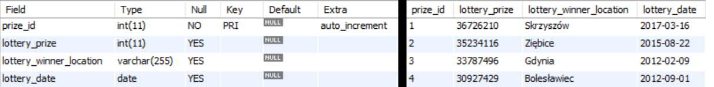
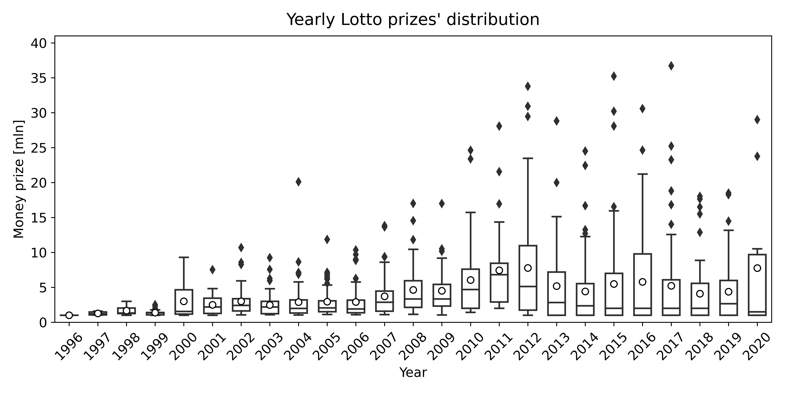
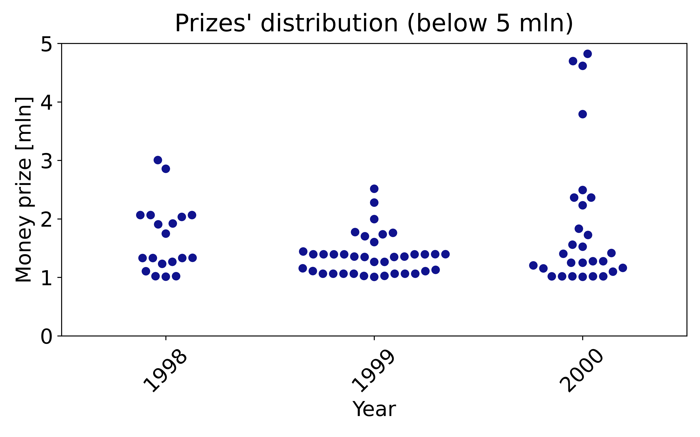
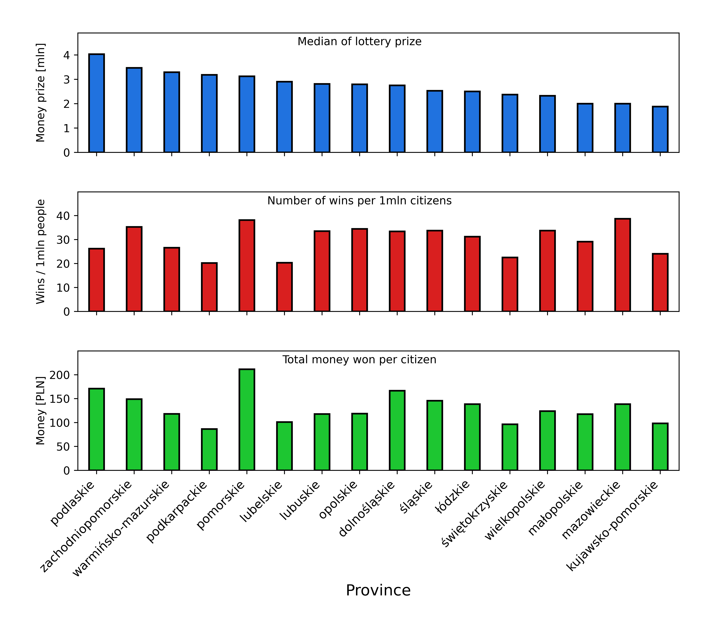

## 1) Introduction
Lotto is the biggest lottery set up in Poland. The main prize goes to those, who correctly select 6 out of 49 numbers and awards reach several dozens of millions of polish zlotys. 

In this project, I am going to analyze data (money award, date, location of the winner) of Lotto main prizes over one million zlotys from the last 20+ years. The analysis will tell, if there are any monthly, yearly and locational patterns in Lotto's wins distribution. While potential findings will not answer how to score 6/6 numbers, it may bring valuable information Lotto's marketers on how, when and where people play Lotto in Poland.

This exploratory data analysis is realized as the final project in "Data Analyst" bootcamp organized by Reaktor PWN.

## 2) Techniques and tools used in the project

* Exploratory analysis
* Web scrapping
* SQL
* Python libraries: numpy, pandas, seaborn, requests, BeautifulSoup, pymysql, sqlalchemy, pingouin, scikit_posthocs 
* Statistics: hypothesis verification with Kruskal-Wallis and Dunn's Multiple Comparison tests

## 3) Data colletion

For data storage, a 'lotto' database was created using MySQL database management system.

Lottery data was scraped from http://megalotto.pl/najwyzsze-wygrane/lotto. From HTML content, data about lottery prize, location of the lottery winner and lottery date was extracted, converted to desired data types and saved in created lottery_data table.

***lottery_data table***

Data about polish cities and provinces was scrapped from https://www.polskawliczbach.pl/Miasta and https://www.polskawliczbach.pl/Wojewodztwa. Tables were opened using pandas data frame, data types were converted to desired and tables were directly saved in database using to_sql() function.

***polish_cities table***

***polish_provinces table***

Permission for one time, noncommercial usage of the data was given by the websites' owners.

## 4) Results

Here, I describe some of the selected results of this project, which may be interesting for the lottery organizers.

### Yearly patterns

The line plot shows how number of wins and money won during the year were changing from 1996 to April 2020. Both parameters were rising till 2008, when there was a change in the tendency - number of wins (so number of people playing) was dropping till 2011. Supposedly this was an aftermath of the 2008 financial crisis and people were playing less. Number of wins started rising again in 2011 till 2014. Money won also started dropping in 2011, but the later increase (2010-2012) precedes increase in number of wins - perhaps the organizers wanted to encourage people for playing and increases the prizes? Both parameters starts slowly decrease from 2014 which I suppose shows that people seem less interested in the lottery.

The latter boxplot shows distribution of money prizes. In the period 2007-2013 median and mean are higher than in other years - less people playing so higher prizes. After 2013 median remains low, on comparable level as before 2007, however is much higher that before 2007. It means, that most of the prizes are rather low, however apparently there are higher rollovers.

To confirm that observed changes are not a result of coincidence and there are years that are significantly different than the others, I perform Kruskal-Wallis test. This test was choose as suitable for many groups of data that do not follow normal distribution.

p-value (p-unc in this case) is very low, showing that at least one year is significantly different than the others. To check which, I perform Dunn's Multiple Comparison post-hoc test, suitable for not normally distributed data. p-values are presented on a heatmap like chart, showing p-values between each pair of years. The darker squares are, the lower p-value is. Significance level was set to 0.01.

Dunn's test results show that the period from 2008 to 2011 is significantly different from the other years, which confirms observation from the previous charts. Interestingly, the year 2012, despite having the highest mean and quite high median, is not as different as years 2008-2011. Also, the year 1999 stands out from the other years. To check potential reasons why is that, I focus on prizes distributions for 2012 and 1999 and see how they are different from other years.

When looking for the charts, one can notice that in 2012, alike in 2013, there were more lower prizes than in 2010 and 2011. This probably the reason why 2012, despite high mean and median, does not stand out from all the years as much as years from 2008 till 2011.
Similar pattern was observed in 1999 - more lower prizes than in 1997 and 2000, what probably makes 1999 more different in Dunn's test results

### Monthly patterns

The line plot shows that number of wins is the highest in Mach and December and the lowest in August. Sum of money won during months is the highest in December and the lowest in summer holiday period (June-July). Overall, these are not big changes comparing with other months and money won is correlated with number of wins to some extent. Interestingly, in September once can observe a peak in money won despite there is no peak in number of wins. This shows that average wins are the highest in September. The reason behind this could be low amount of money won during summer holiday season, therefore more high rollovers may happen in September. This is also visible in the boxplot, however there difference is not huge comparing with other months. The medians of wins are at the comparable level throughout the whole year. Based on this chart, and Kruskal test results below (p-value (p-unc) = 0,44), one can say that none of the month stands out in terms of playing lottery.

### Geographical patterns

Poland is divided into 16 provinces. I aim to analyze how people play lottery in polish provinces and if there are any differences between provinces. I am going to check median of wins, number of wins per 1 mln people and amount of money won per citizen. To do that, I merge lottery_data, polish_cities and polish_provinces tables, and then plot mentioned statistics.

The chart shows that number of wins per 1 mln and amount of money won per citizen are not corelated. In Podlaskie the media is the highest but number of wins is rather low. On the other side there is Mazowieckie, where median is very low but number of wins is the highest. In Pomorskie median is relatively high and number of wins is the second-highest. Also, in Pomorskie amount of money won per citizen is the highest. This implies different playing pattern in different provinces. I analyze couple of provinces to show different patterns in prizes distribution.

In Mazowieckie one observes highly skewed distribution. In this province the number of wins per 1 mln people is the highest, which means that people play the most among all the provinces. However, most of the prizes are low, which may imply that people in this province play regardless the amount of prize to win.

Similar distribution is observed in Kujawsko-Pomorskie, which again suggest that people here play no matter what is the amount of prize. However, much less people play comparing with Mazowieckie province.

Different distribution is observed in Podlaskie. Data is not skewed like in previous provinces. People in Podlaskie do not play much (low number of wins per 1 mln people), however they do when a rollover happens and prizes are higher.

An interesting situiation happens in Pomorskie. High amount of wins per 1 mln citizens shows that people play eagerly in lotto, similarly like in Mazowieckie. However, data is not as skewed, therefore there is another pattern in this province. Suggesting explanation is that there are 2 kinds of populations here: one that plays regardless rollovers, and the other that starts playing only when one can win highest prizes. This would explain very high number of wins per 1 mln citizens and the highest amount of money won per citizen in province.

## 5) Conclusions and applications

* Yearly patterns suggest that poor economic situation situation may discourage people for playing.

* Monthly patters reveal that people play the most during Christmas season. Differences throughout the year are not big and none of the month stands out statistically from the others.

* Geography data exploration show that there are different patterns in playing lottery - people different provinces play more or less often. Also, in some provinces people play more (or only) when there are rollovers, while in others play always, regardless amount of money to win.

* Outcome of this project may help develop more effective strategies in advertising the lottery - where, when and what kinds of adverts people should see to encourage them more for playing.
